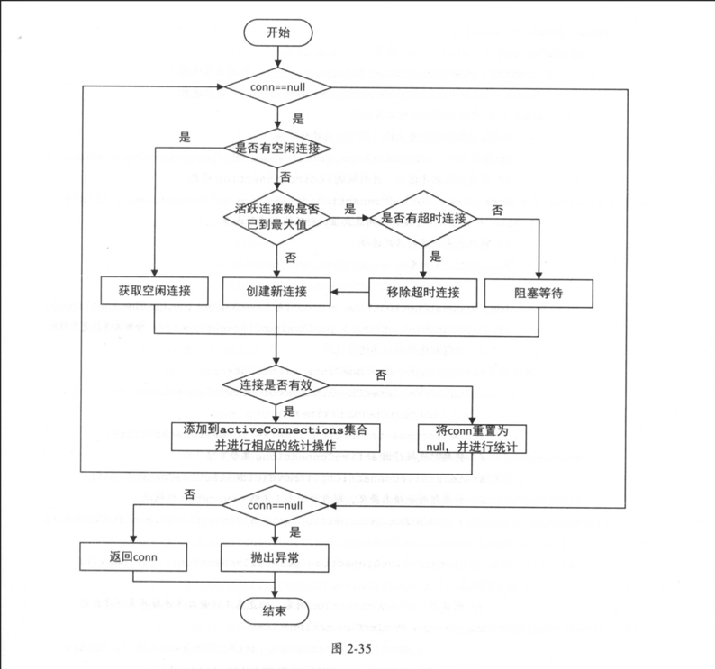

#Mybatis技术内幕2.4～2.7

## 2.4 日志模块
良好的日志在 一个软件中占了非常重要的地位，日志是开发与运维管理之间的桥梁。
日志可以帮助运维人员和管理人员快速查找系统的故障和瓶颈 ，也可以帮助开发人员与运维人员沟通，更好地完成开发和运维任务。
但日志的信息量会随着软件运行时间不断变多，所以需要定期汇总和清理，避免影响服务器的正常运行。

在 Java 开发中常用的日志框架有 Log4j、Log4j2、Apache Commons Log、java.util.logging、slf4j等，这些工具对外的接口不尽相同。为了统一这些工具的接口，MyBatis定义了一套统一的日志接口供上层使用，并为上述常用的日志框架提供了相应的适配器。

### 2.4.1 适配器模式
首先，我们简单介绍设计模式中有六大原则。
* 单一职责原则:不要存在多于一个导致类变更的原因，简单来说，一个类只负责唯一项职责。
* 里氏替换原则:如果对每一个类型为T1的对象t1，都有类型为T2的对象t2，使得以T1定义的所有程序P在所有的对象t1都代换成t2时，程序P的行为没有发生变化，那么类型T2是类型T1的子类型。遵守里氏替换原则，可以帮助我们设计出更为合理地继承体系。
* 依赖倒置原则:系统的高层模块不应该依赖低层模块的具体实现，二者都应该依赖其抽象类或接口，抽象接口不应该依赖具体实现类，而具体实现类应该于依赖抽象。简单来说，我们要面向接口编程。当需求发生变化时对外接口不变，只要提供新地实现类即可 。
* 接口隔离原则:一个类对另一个类的依赖应该建立在最小的接口上。简单来说，我们在设计接口时，不要设计出庞大膝肿的接口，因为实现这种接口时需要实现很多不必要的方法。我们要尽量设计出功能单一的接口，这样也能保证实现类的职责单一。
* 迪米特法则:一个对象应该对其他对象保持最少的了解。简单来说，就是要求我们减低类间祸合。
* 开放-封闭原则:程序要对扩展开放，对修改关闭。简单来说，当需求发生变化时，我们可以通过添加新的模块满足新需求，而不是通过修改原来的实现代码来满足新需求 。

在这六条原则中，开放-封闭原则是最基础的原则，也是其他原则以及后文介绍的所有设计模式的最终目标。

下面回到适配器模式的介绍，适配器模式的主要目的是解决由于接口不能兼容而导致类无法使用的问题，适配器模式会将需要适配的类转换成调用者能够使用的目标接口。这里先介绍适配器模式涉及的几个角色：
* 目标接口(Target):调用者能够直接使用的接口 。
* 需要适配的类(Adaptee):一般情况下，Adaptee类中有真正的业务逻辑，但是其接口不能被调用者直接使用。
* 适配器(Adapter): Adapter实现了Target接口，并包装了一个Adaptee对象。Adapter在实现Target接口中的方法时，会将调用委托给Adaptee对象的相关方法，由Adaptee完成具体的业务。

优点：对应用程序中的接口做了兼容，可以尽可能地进行组件的复用  
缺点：当程序中存在过多的适配器时，会让程序非常复杂

在MyBatis的日志模块中，就使用了适配器模式。MyBatis内部调用其日志模块时，使用了其内部接口(也就是后面要介绍的org.apache.ibatis.logging.Log接口)。

MyBatis 为了集成和复用这些第三方日志组件，在其日志模块中提供了多种 Adapter，
将这些第三方日志组件对外的接口适配成了org.apache.ibatis.logging.Log接口，
这样MyBatis内部就可以统一通过[org.apache.ibatis.logging.Log](src/main/java/com/huangmaojie/read/mybatis/logger/adaptor/Log.java) 接口调用第三方日志组件的功能了。

### 2.4.2 日志适配器
前面描述的多种第三方日志组件都有各自的Log级别，且都有所不同，例如java.util.logging提供了All、FINEST、FINER、FINE、CONFIG、INFO、WARNING等9种级别，而Log4j2则只有trace、debug、info、warn、error、fatal这 6种日志级别。
MyBatis统一提供了trace、debug、warn、error四个级别，这基本与主流日志框架的日志级别类似，可以满足绝大多数场景的日志需求。

MyBatis 的日志模块位于org.apache.ibatis.logging包中，该模块中通过[Log.java](src/main/java/com/huangmaojie/read/mybatis/logger/adaptor/Log.java)接口定义了日志 模块的功能，当然日志适配器也会实现此接口。
[LogFactory.java](src/main/java/com/huangmaojie/read/mybatis/logger/adaptor/LogFactory.java)工厂类负责创建对应的日志组件适配器，如图2-24所示。

### 2.4.3 代理模式与JDK动态代理
在下一小节要介绍的JDBC调试功能中会涉及代理模式与JDK动态代理的相关知识，所以在继续介绍日志模块中JDBC调试功能的实现之前，先来简单介绍一下代理模式以及JDK动态代理的实现和原理。

* [Subject](src/main/java/com/huangmaojie/read/mybatis/logger/agency/Subject.java)是程序中的业务逻辑接口，
* [RealSubject](src/main/java/com/huangmaojie/read/mybatis/logger/agency/RealSubject.java)是实现了Subject接口的真正业务类，
* [Proxy](src/main/java/com/huangmaojie/read/mybatis/logger/agency/Proxy.java)是实现了Subject接口的代理类，其中封装了RealSubject对象。

在程序中不会直接调用RealSubject对象的方法，而是使用Proxy对象实现相关功能。 
Proxy.operation()方法的实现会调用RealSubject对象的operation()方法执行真正的业务逻辑，但是处理完业务逻辑，
Proxy.operation()会在RealSubject.operation()方法调用前后进行预处理和相关的后置处理。这就是所谓的“代理模式”。  

* 使用代理模式可以控制程序对RealSubject对象的访问，或是在执行业务处理的前后进行相关的预处理和后置处理。
* 代理模式还可以用于实现延迟加载的功能.我们知道查询数据库是一个耗时的操作，而有些时候查询到的数据也并没有真正被程序使用。
延迟加载功能就可以有效地避免这种浪费，系统访问数据库时，首先可以得到一个代理对象，此时并没有执行任何数据库查询操作代理对象中自然也没有真正的数据，当系统真正需要使用数据时，再调用代理对象完成数据库查询井返回数据。 
MyBatis中延迟加载功能的大致原理也是如此。另外，代理对象可以协调真正RealSubject对象与调用者之间的关系，在一定程度上实现了解耦的效果。

熟悉Java编程的读者可能会说，我们可以使用JDK动态代理解决这个问题。JDK动态代理的核心是InvocationHandler接口。
这里提供一个InvocationHandler的示例实现
[MyJdkProxyTest](src/main/java/com/huangmaojie/read/mybatis/logger/agency/MyJdkProxyTest.java)

通过本小节的介绍我们可以知道，JDK动态代理的实现原理是动态创建代理类井通过指定类加载器加载，然后在创建代理对象时将InvokerHandler对象作为构造参数传入。
当调用代理对象时，会调用InvokerHandler.invoke()方法，并最终调用真正业务对象的相应方法 。 
JDK动态代理不仅在MyBatis的多个模块中都有所涉及，在很多开源框架中也能看到其身影。

### 2.4.4 JDBC 调试
在MyBatis的日志模块中有一个Jdbc包，它并不是将日志信息通过JDBC保存到数据库中，而是通过JDK动态代理的方式，将JDBC操作通过指定的日志框架打印出来。这个功能通常在开发阶段使用，它可以输出SQL语句、用户传入的绑定参数、SQL语句影响行数等等信息，对调试程序来说是非常重要的。
[BaseJdbcLogger](src/main/java/com/huangmaojie/read/mybatis/logger/adaptor/jdbc/BaseJdbcLogger.java)是一个抽象类，它是Jdbc包下其他Logger类的父类，继承关系如图2-26所示。

[ConnectionLogger](src/main/java/com/huangmaojie/read/mybatis/logger/adaptor/jdbc/ConnectionLogger.java)继承了BaseJdbcLogger抽象类，其中封装了Connection对象井同时实现了InvocationHandler接口。
ConnectionLogger.newInstance()方法为会为其封装的Connection对象创建相应的代理对象

[PreparedStatementLogger](src/main/java/com/huangmaojie/read/mybatis/logger/adaptor/jdbc/PreparedStatementLogger.java)中封装了PreparedStatement对象，也继承了BaseJdbcLogger抽象类井实现了InvocationHandler接 口 。
PreparedStatementLogger.invoke()方法会为EXECUTE_METHODS集合中的方法、SET_METHODS集合中的方法、getResultSet()等方法提供代理，

[ResultSetLogger](src/main/java/com/huangmaojie/read/mybatis/logger/adaptor/jdbc/ResultSetLogger.java)中封装了ResultSet对象，也继承了BaseJdbcLogger抽象类并实现了InvocationHandler接口
ResultSetLogger.invoke()方法的实现会针对ResultSet.next()方法的调用进行一系列后置操作，通过这些后置操作会将 ResultSet数据集中的记录全部输出到 日志中

## 2.5 资源加载
### 2.5.1 类加载器简介
Java虚拟机中的类加载器(ClassLoader)负责加载来自文件系统、网络或其他来源的类文件。 
Java虚拟机中的类加载器默认使用的是双亲委派模式，如图 2-27所示，其中有三种默认使用的类加载器，分别是Bootstrap ClassLoader、Extension ClassLoader和System ClassLoader(也被称为ApplicationClassLoader)，每种类加载器都己经确定从哪个位置加载类文件。

* BootstrapClassLoader负责加载JDK自带的rt.jar包中的类文件，它是所有类加载器的父加载器，Bootstrap ClassLoader没有任何父类加载器。
* Extension ClassLoader负责加载Java的扩展类库，也就是从jre/lib/ext目录下或者java.ext.dirs系统属性指定的目录下加载类。
* System ClassLoader负责从classpath环境变量中加载类文件，classpath环境变量通常由"-classpath"或"-cp"命令行选项来定义，或是由JAR中Manifest文件的classpath属性指定。
System ClassLoader是ExtensionClassLoader的子加载器。

根据双亲委派模式，在加载类文件时，子加载器首先会将加载请求委托给它的父加载器。 
父加载器会检测自己是否已经加载过该类，如果己加载则加载过程结束;如果未加载则请求继续向上传递直到Bootstrap ClassLoader。
如果在请求向上委托的过程中，始终未检测到该类己加载，则从Bootstrap ClassLoader开始尝试从其对应路径中加载该类文件，如果加载失败则由子加载器继续尝试加载，直至发起加载请求的子加载器位为止。
双亲委派模式可以保证两点 : 
1. 子加载器可以使用父加载器己加载的类，而父加载器无法使用子加载器己加载的类:
2. 父加载器己加载过的类无法被子加载器再次加载。这样就可以保证NM的安全性和稳定性。

除了系统提供三种类加载器，开发人员也可以通过继承java.lang.ClassLoader类的方式实现自己的类加载器，以满足一些特殊的需求，
如图2-27中的Custom ClassLoaderA、B、C 所示。使用自定义类加载器的场景还是比较多的，例如Tomcat、JBoss等都涉及了自定义类加载器的使用。

在很多场景中，系统会同时使用不同的类加载器完成不同的任务，这里以Tomcat为例简单介绍一下。
* 在Tomcat中提供了一个CommonClassLoader，它主要负责加载Tomcat使用的类和Jar包以及应用通用的一些类和Jar包，例如CATALINA_HOME/lib目录下的所有类和 Jar包。
Tomcat本身是一个应用系统，所以Common ClassLoader的父加载器是SystemClassLoader 
* Tomcat还提供了CatalinaLoader和SharedLoader两个类加载器，它们的父加载器是Common ClassLoader。但是默认情况下，CatalinaLoader和SharedLoader两个类加载器的相应配置(CATALINA_HOME/conf/catalina.properties配置文件中serverl.loader和shared.loader配置项)
是空的，也就是说，这两个类加载器默认情况下与CommonClassLoader为同一个加载器。
* tomcat会为每个部署的应用创建一个唯一的类加载器，也就是WebApp ClassLoader，它负责加载该应用的WEB-INF/lib目录下的Jar文件以及WEB-INF/classes目录下的Class文件。由于每个应用都有自己的WebApp ClassLoader，这样就可以使不同的Web应用之间互相隔离，彼此之间看不到对方使用的类文件 。当对应用进行热部署时，会抛弃原有的WebApp ClassLoader, 并为应 用创建新的WebApp ClassLoader。 
WebApp ClassLoader的父加载器是Common ClassLoader，所以不同的应用可以使用Common ClassLoader加载的共享类库。最终我们得到Tomcat中的类加载器的结构如图2-28 所示 。

### 2.5.2 ClassLoaderWrapper
在IO包中提供的[ClassLoaderWrapper](src/main/java/com/huangmaojie/read/mybatis/resource/wrapper/ClassLoaderWrapper.java)是一个ClassLoader的包装器，其中包含了多个ClassLoader对象。 
通过调整多个类加载器的使用顺序，ClassLoaderWrapper可以确保返回给系统使用的是正确的类加载器。 
使用ClassLoaderWr叩per就如同使用一个ClassLoader对象，ClassLoaderWrapper会按照指定的顺序依次检测其中封装的ClassLoader对象，并从中选取第一个可用的ClassLoader完成相关功能。

ClassLoaderWrapper的主要功能可以分为三类，分别是getResourceAsURL()方法、classForName()方法、getResourceAsStream()方法

Resources是一个提供了多个静态方法的工具类，其中封装了一个ClassLoaderWrapper类型的静态字段，Resources 提供的这些静态工具都是通过调用该ClassLoaderWrapper对象的相应方法实现的。

### 2.5.3 ResolverUtil
[ResolverUtil](src/main/java/com/huangmaojie/read/mybatis/resource/resolverutil/ResolverUtil.java)可以根据指定的条件查找指定包下的类，其中使用的条件由Test接口表示。ResolverUtil中使用classLoader字段(ClassLoader类型)记录了当前使用的类加载器，默认情况下，使用的是当前线程上下文绑定的ClassLoader，我们可以通过setClassLoader()方法修改使用类加载器。
MyBatis提供了两个常用的Test接口实现，分别是IsA和AnnotatedWith，如图 2-29所示。
IsA用于检测类是否继承了指定的类或接口，AnnotatedWith用于检测类是否添加了指定的注解。 
开发人员也可以自己实现Test接口，实现指定条件的检测。

ResolverUtil.findImplementations()方法和ResolverUtil.findAnnotated()方法都是依赖ResolverUtil.find()方法实现的， 
findImplementations()方法会创建IsA对象作为检测条件，findAnnotated()方法会创建AnnotatedWith对象作为检测条件。
这几个方法的调用关系如图 2-30所示

### 2.5.4 单例模式
[单例模式](src/main/java/com/huangmaojie/read/mybatis/resource/singleton/Singleton.java)是一种比较常见的设计模式，但是在Java中要用好单例模式，并不是一件简单的事。在整个系统中，单例类只能有一个实例对象，且需要自行完成示例，并始终对外提供同一实例对象。
因为单例模式只允许创建一个单例类的实例对象，避免了频繁地创建对象，所以可以减少GC的次数，也比较节省内存资源，加快对象访问速度。
例如，数据库连接池、应用配置等一般都是单例的。在下面介绍的VFS中，也涉及单例模式的使用。

### 2.5.5 VFS
[VFS](src/main/java/com/huangmaojie/read/mybatis/resource/vfs/VFS.java)表示虚拟文件系统(VirtualFileSystem)，它用来查找指定路径下的资源。 
VFS是一个抽象类，MyBatis中提供了[JBoss6VFS](src/main/java/com/huangmaojie/read/mybatis/resource/vfs/JBoss6VFS.java)
和[DefaultVFS](src/main/java/com/huangmaojie/read/mybatis/resource/vfs/DefaultVFS.java)两个VFS的实现，如图2-31所示。
用户也可以提供自定义的VFS实现类

## 2.6 DataSource
在数据持久层中，数据源是一个非常重要的组件，其性能直接关系到整个数据持久层的性能。
在实践中比较常见的第三方数据源组件有Apache Common DBCP,C3PO、Proxool等，MyBatis不仅可以集成第三方数据源组件，还提供了自己的数据源实现。
常见的数据源组件都实现了[javax.sql.DataSource](src/main/java/com/huangmaojie/read/mybatis/datasource/DataSource.java)接口，MyBatis 自身实现的数据源实现也不例外。
MyBatis提供了两个javax.sql.DataSource接口实现，分别是[PooledDataSource](src/main/java/com/huangmaojie/read/mybatis/datasource/pooled/PooledDataSource.java)
和[PooledDataSource](src/main/java/com/huangmaojie/read/mybatis/datasource/unpooled/UnpooledDataSource.java)。
Mybatis使用不同的DataSourceFactory接口实现创建不同类型的 DataSource，如图 2-32 所示，这是工厂方法模式的一个典型应用。

### 2.6.1 工厂方法模式
在工厂方法模式中，定义了一个用于创建对象的工厂接口，并根据工厂接口的具体实现类决定具体实例化哪一个具体产品类。 
首先来看工厂方法模式的结构，如图2-33所示。

工厂方法模式有四个角色构成。
* 工厂接口(Factory): 工厂接口是工厂方法模式的核心接口，调用者会直接与工厂接口交互用于获取具体的产品实现类。
* 具体工厂类(ConcreteFactory): 具体工厂类是工厂接口的实现类，用于实例化产品对象，不同的具体工厂类会根据需求实例化不同的产品实现类。
* 产品接口(Product): 产品接口用于定义产品类的功能，具体工厂类产生的所有产品对象都必须实现该接口。调用者一般会面向产品接口进行编程，所以产品接口会与调用者直接交互，也是调用者最为关心的接口。
* 具体产品类(ConcreteProduct): 实现产品接口的实现类，具体产品类中定义了具体的业务逻辑。

如果需要产生新的产品，例如对于MyBatis的数据源模块来说，就是添加新的第三方数据源组件，只需要添加对应的工厂实现类，新数据源就可以被MyBatis使用，而不必修改已有的代码。
显然，工厂方法模式符合“开放-封闭”原则。除此之外，工厂方法会向调用者隐藏具体产品类的实例化细节，调用者只需要了解工厂接口和产品接口，面向这两个接口编程即可。

工厂方法模式也是存在缺点的。在增加新产品实现类时，还要提供一个与之对应的工厂实现类，所以实际新增的类是成对出现的，这增加了系统的复杂度。
另外，工厂方法模式引入了工厂接口和产品接口这一层抽象，调用者面向该抽象层编程，增加了程序的抽象性和理解难度。

### 2.6.2 DataSourceFactory
在数据源模块中，[DataSourceFactory](src/main/java/com/huangmaojie/read/mybatis/datasource/DataSourceFactory.java)接口扮演工厂接口的角色。
[UnpooledDataSourceFactory](src/main/java/com/huangmaojie/read/mybatis/datasource/unpooled/UnpooledDataSourceFactory.java)和
[PooledDataSourceFactory](src/main/java/com/huangmaojie/read/mybatis/datasource/pooled/PooledDataSourceFactory.java)则扮演着具体工厂类的角色。

### 2.6.3 UnpooledDataSource
[javax.sql.DataSource](src/main/java/com/huangmaojie/read/mybatis/datasource/DataSource.java)接口在数据源模块中扮演了产品接口的角色，MyBatis提供了两个DataSource接口的实现类，分别是UnpooledDataSource和PooledDataSource，它们扮演着具体产品类的角色。
[UnpooledDataSource](src/main/java/com/huangmaojie/read/mybatis/datasource/unpooled/UnpooledDataSource.java)实现了javax.sql.DataSource接口中定义的 getConnection()方法及其重载方法，用于获取数据库连接。
每次通过UnpooledDataSource.getConnection()方法获取数据库连接 时都会创建一个新连接。

### 2.6.4 PooledDataSource
了解JDBC编程的读者知道，数据库连接的创建过程是非常耗时的，数据库能够建立的连接数也非常有限，所以在绝大多数系统中，数据库连接是非常珍贵的资源，使用数据库连接池
就显得尤为必要。使用数据库连接池会带来很多好处，例如，可以实现数据库连接的重用、提高响应速度、防止数据库连接过多造成数据库假死、避免数据库连接泄露等。

数据库连接池在初始化时，一般会创建一定数量的数据库连接并添加到连接池中备用。
当程序需要使用数据库连接时，从池中请求连接;
当程序不再使用该连接时，会将其返回到池中缓存，等待下次使用，而不是直接关闭。
当然，数据库连接池会控制连接总数的上限以及空闲 连接数的上限，如果连接池创建的总连接数己达到上限，且都己被占用，则后续请求连接的线程会进入阻塞队列等待，直到有钱程释放出可用的连接。
如果连接池中空闲连接数较多，达到其上限，则后续返回的空闲连接不会放入池中，而是直接关闭，这样可以减少系统维护多余数 据库连接的开销。

* 如果将总连接数的上限设置得过大，可能因连接数过多而导致数据库僵死，系统整体性能下降;
* 如果总连接数上限过小，则无法完全发挥数据库的性能，浪费数据库资源。
* 如果将空闲连接的上限设置得过大，则会浪费系统资源来维护这些空闲连接:
* 如果空闲连接上限过小，当出现瞬间的峰值请求时，系统的快速响应能力就比较弱。
所以在设置数据库连接池的这两个值时，需要进行性能测试、权衡以及一些经验。

[PooledDataSource](src/main/java/com/huangmaojie/read/mybatis/datasource/pooled/PooledDataSource.java)实现了简易数据库连接池的功能，它依赖的组件如图2-34所示，其中需要注意的是，PooledDataSource创建新数据库连接的功能是依赖其中封装的UnpooledDataSource对象实现的。

PooledDataSource.getConnection()方法首先会调用PooledDataSource.popConnection()方法获取PooledConnection对象，然后通过PooledConnection.getProxyConnection()方法获取数据库连接的代理对象。 
popConnection()方法是PooledDataSource的核心逻辑之一，其具体逻辑如图2-35所示。

通过前面对 PooledConnection.invoke()方法的分析我们知道，当调用连接的代理对象的close()方法时，并未关闭真正的数据连接，而是调用 PooledDataSource.pushConnection()方法将PooledConnection对象归还给连接池，供之后重用。 
PooledDataSource.pushConnection()方法也是PooledDataSource的核心逻辑之一，其逻辑如图2-36所示。

### 2.7 Transaction
在实践开发中，控制数据库事务是一件非常重要的工作，MyBatis使用[Transaction](src/main/java/com/huangmaojie/read/mybatis/transaction/Transaction.java)接口对数据库事务进行了抽象

Transaction接口有[JdbcTransaction](src/main/java/com/huangmaojie/read/mybatis/transaction/jdbc/JdbcTransaction.java)、
[ManagedTransaction](src/main/java/com/huangmaojie/read/mybatis/transaction/managed/ManagedTransaction.java)
两个实现，其对象分别由[JdbcTransactionFactory](src/main/java/com/huangmaojie/read/mybatis/transaction/jdbc/JdbcTransactionFactory.java)
和[ManagedTransactionFactory](src/main/java/com/huangmaojie/read/mybatis/transaction/managed/ManagedTransactionFactory.java)负责创建。 
如图2-37所示，这里也使用了工厂方法模式。

JdbcTransaction依赖于JDBC Connection控制事务的提交和回滚。

ManagedTransaction的实现更加简单，它同样依赖其中的dataSource宇段获取连接，但其commit()、rollback()方法都是空实现，事务的提交和回滚都是依靠容器管理的。

在实践中， MyBatis通常会与Spring集成使用，数据库的事务是交给Spring进行管理的，在第4章会介绍Transaction接口的另一个实现一[SpringManagedTransaction](src/main/java/com/huangmaojie/read/mybatis/transaction/spring/SpringManagedTransaction.java)